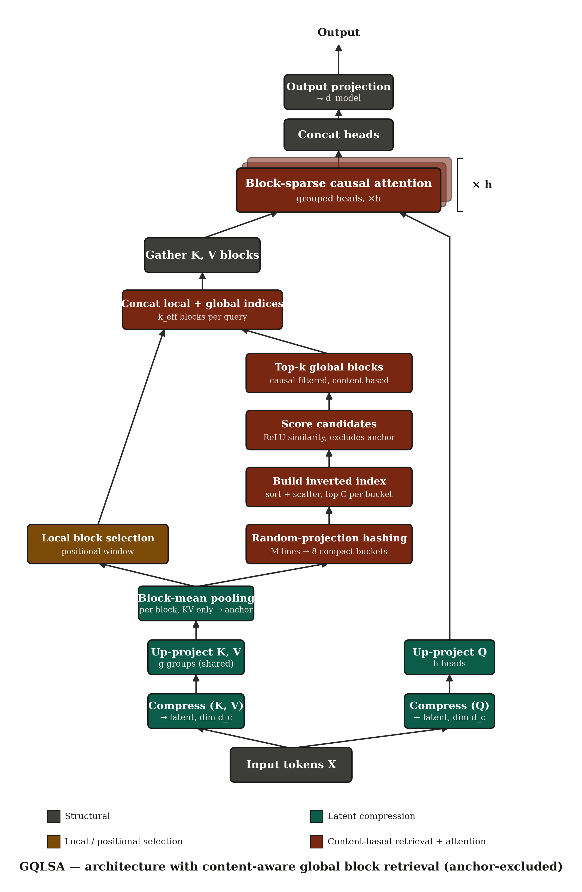
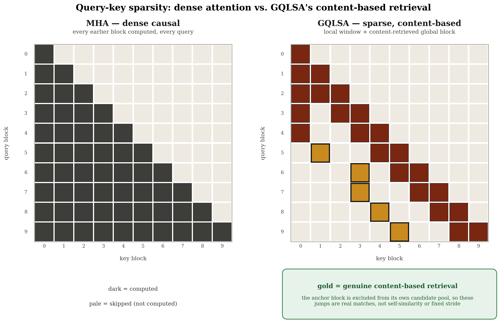
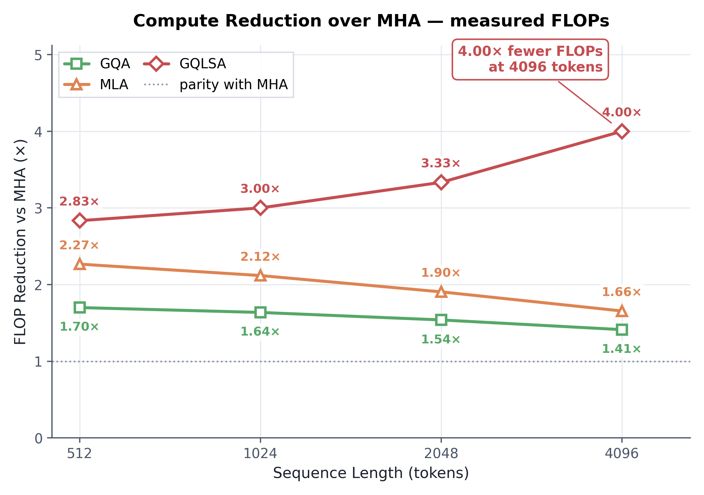
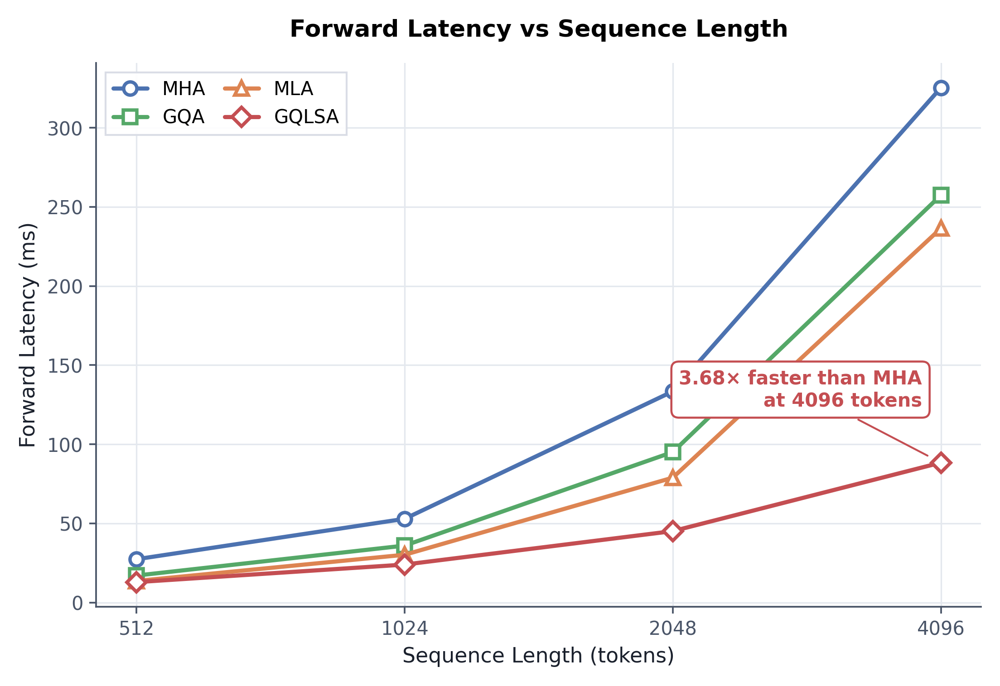
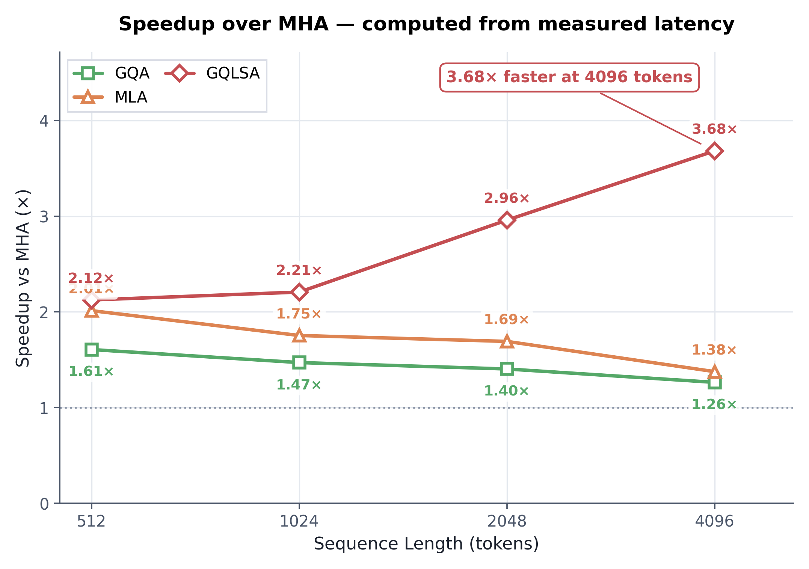
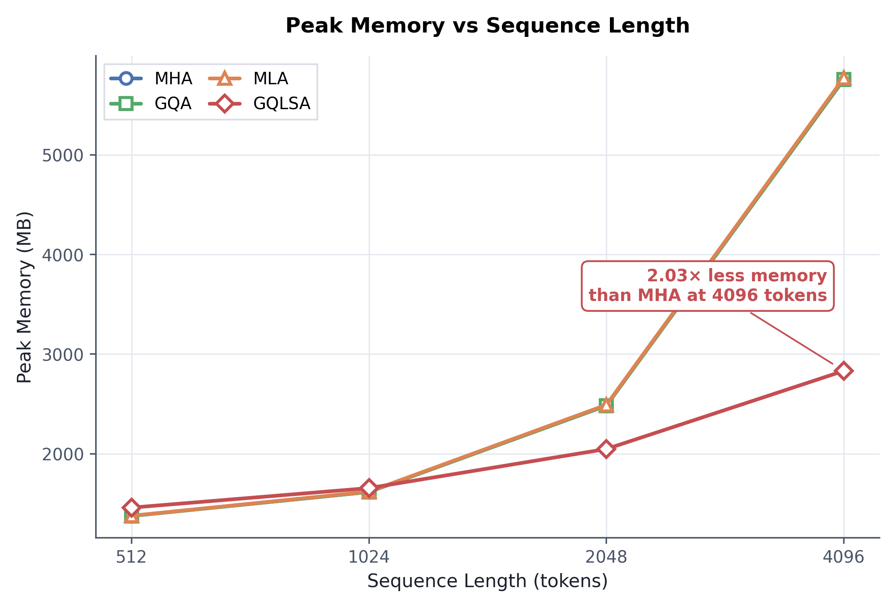
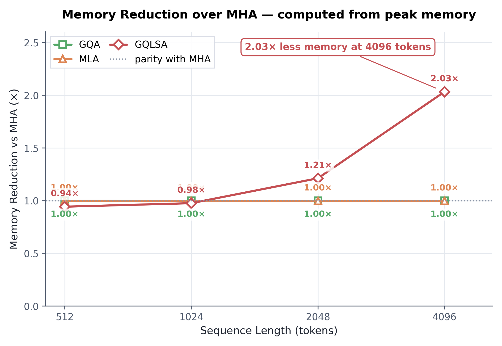
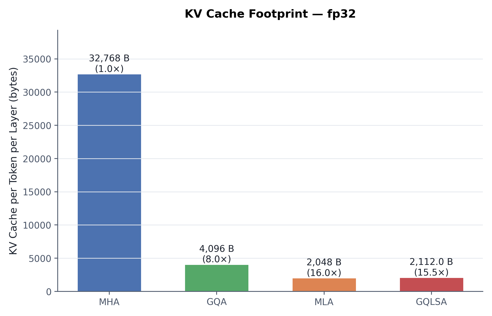
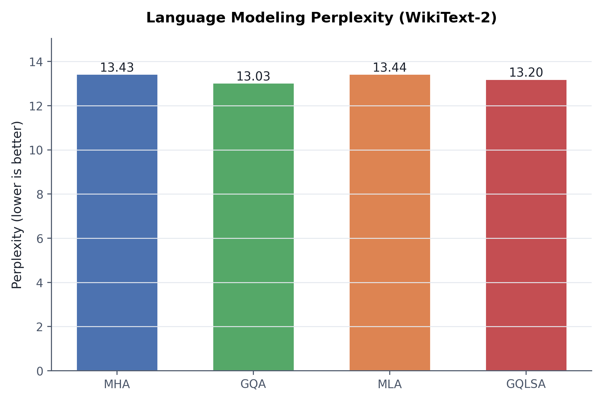

# GQLSA: Grouped-Query Latent Sparse Attention

[](https://doi.org/10.5281/zenodo.22818585)
[](https://creativecommons.org/licenses/by-nc-sa/4.0/)
[](https://www.python.org/)
[](https://pytorch.org/)
[]()

**A compositional attention mechanism that computes only where it matters.**

GQLSA unifies three orthogonal efficiency axes — latent KV compression, grouped-query head sharing, and content-retrieved block sparsity — into a single hardware-native attention primitive with a fully vectorized retrieval path.

**Paper:** [10.5281/zenodo.22818585](https://doi.org/10.5281/zenodo.22818585)

---

## Architecture

<p align="center">
  
</p>

The forward pass compresses input tokens into a shared low-rank latent, up-projects to grouped Q/K/V heads, and for each query block selects a fixed set of attended blocks via two paths:

- **Local (positional):** a fixed sliding window of the nearest blocks.
- **Global (content-based):** blocks retrieved by similarity to the query anchor through an inverted index over random-projection bucket signatures, with the anchor block excluded to prevent self-match.

Both paths are concatenated and passed to a block-sparse causal attention kernel. Causality is enforced at two levels: cross-block candidates are strictly before the local window, and same-block attention is masked with an upper-triangular mask.

---

## Query-key sparsity

<p align="center">
  
</p>

**Left:** dense causal MHA computes every earlier block for every query — quadratic scaling. **Right:** GQLSA restricts each query to a fixed local window plus content-retrieved global blocks. Gold cells mark genuine content-based retrieval jumps; the number of computed cells per query row is constant in GQLSA and grows linearly with row index in MHA.

---

## Efficiency

<p align="center">
  
</p>

**Compute reduction (measured FLOPs).** GQLSA's reduction over MHA grows monotonically with sequence length, reaching **4.00× at 4096 tokens**, while GQA and MLA plateau or decline. This is the asymptotic signature of linear attention compute against quadratic dense attention.

<p align="center">
  
</p>

**Forward latency.** GQLSA's curve is visibly sub-quadratic. At 4096 tokens it is **3.68× faster** than MHA.

<p align="center">
  
</p>

**Wall-clock speedup.** The speedup tracks the FLOP reduction closely, indicating the implementation is arithmetic-bound rather than memory-bound or launch-overhead-bound.

<p align="center">
  
</p>

**Peak memory.** GQA and MLA track MHA almost exactly — activation memory dominates for those mechanisms. GQLSA diverges above the ~1.5K-token crossover and reaches **2.03× less memory** at 4096 tokens.

<p align="center">
  
</p>

**Memory reduction.** GQLSA uses **50.8% less peak memory** than MHA at 4096 tokens.

<p align="center">
  
</p>

**KV cache footprint per token, per layer (fp32).** GQLSA's cache is nearly identical to MLA's (a 3% overhead from block means) and **15.5× smaller** than MHA's.

---

## Quality

<p align="center">
  
</p>

Char-level language modeling on WikiText-2. GQLSA ranks **second of four mechanisms**, ahead of MHA (13.43) and MLA (13.44), and within 1.3% of GQA (13.03). The perplexity spread across all four is under 3% — a narrow band consistent with a small-scale benchmark. Reported as an initial signal.

---

## Summary table

| Metric (Tesla T4, 4096 tokens) | GQLSA | vs MHA |
|---|---|---|
| Attention FLOPs | 206.17 GFLOP | **4.00× reduction** |
| Wall-clock latency | 88.2 ms | **3.68× speedup** |
| Peak memory | 2,900 MB | **2.03× reduction** |
| KV cache / token / layer | 2,112 B | **15.5× reduction** |
| Attention parameters | 23.59 M | **2.8× fewer** |
| WikiText-2 perplexity | 13.20 | rank 2 of 4 |

Every efficiency ratio grows monotonically with sequence length.

---

## Installation

```bash
git clone https://github.com/fardinsabid/gqlsa.git
cd gqlsa
pip install -r requirements.txt
```

Python 3.10+ and PyTorch 2.x required.

---

## Quick start

```python
import torch
from attention.gqlsa import GQLSA

attention = GQLSA(
    d_model=4096,
    h=32,
    g=4,
    d_k=128,
    d_v=128,
    d_c=512,
    local_window=128,
    top_k=64,
    block_size=32,
    retrieval_M=4,
    retrieval_bucket_width=0.5,
    retrieval_c_max=16,
    bucket_count=8,
)

x = torch.randn(2, 512, 4096)
output = attention(x)   # [2, 512, 4096]
```

See [`examples/basic_usage.py`](examples/basic_usage.py) for the full example, including causality and content-dependence checks.

---

## Inference cache

`GQLSA.forward()` runs on a full sequence and is the reference. For generation, `GQLSA.forward_step()` consumes one token at a time and reuses cached K/V/latents — the cost per token is **constant in sequence length** instead of growing with it.

### Usage

```python
import torch
from attention.gqlsa import GQLSA, GQLSAState

attention = GQLSA(
    d_model=4096, h=32, g=4, d_k=128, d_v=128, d_c=512,
    local_window=128, top_k=64, block_size=32,
).eval()

state: GQLSAState = attention.init_state(
    batch_size=1, max_seq_len=2048,
)

# Prime with prompt tokens (one forward_step per token)
prompt_emb = torch.randn(1, 64, 4096)   # [B, T0, d_model]
with torch.no_grad():
    for i in range(prompt_emb.shape[1]):
        _ = attention.forward_step(prompt_emb[:, i:i+1], state, start_pos=i)

# Generate
for step in range(max_new_tokens):
    x_new = compute_next_token_embedding()   # [1, 1, d_model]
    out = attention.forward_step(x_new, state, start_pos=64 + step)
```

### Guarantees

- **Numerically equivalent** to `forward()` on the same prefix. Max abs diff `< 3e-7` in fp32 (rounding only). Verified by `test_cache_equivalence` in `tests/`.
- **Causal.** A perturbation at position `p` does not change outputs at positions `< p`. Verified by `test_causality_of_forward_step`.
- **No change to `forward()`.** `forward` and `_get_block_indices` are byte-identical to v1.0.0. `state_dict()` keys and order are unchanged; v1.0.0 checkpoints load without modification.
- **No new parameters.** `GQLSAState` holds only intermediate tensors and counters. It is not serialized, not saved, and not part of the model. Recreate it per generation session.

### Cost per token

| | v1.0.0 `forward()` per step | v1.0.1 `forward_step()` |
|---|---|---|
| Attention work per token | O(T · k_eff · block_size) | O(k_eff · block_size) |
| Retrieval work per token | O(N · M · C_MAX) | O(M · C_MAX) |
| Scales with position | yes | **no** |

Measured on Tesla T4, `d_model=768, h=12, g=3, d_c=384, local_window=128, top_k=32, block_size=32`:

| | 500-token generation |
|---|---|
| `forward()` per step | 1.60 s (312 tok/s) |
| `forward_step()` | 0.90 s (555 tok/s) |

The speedup grows with sequence length. At 100 tokens the two are close; at 2000 tokens the cached path is several times faster; the gap widens without bound because `forward_step` cost is flat.

### Limitations

- `forward_step()` accepts exactly one token per call. Batched or multi-token incremental forward is not supported in v1.0.1.
- `GQLSA` is position-agnostic. The caller supplies `start_pos` and is responsible for any position-aware operations outside GQLSA (learned positional embeddings, RoPE, etc.).
- State capacity is fixed at `init_state()`. Exceeding `max_seq_len` raises `RuntimeError`.

---

## Repository layout

```
attention/              GQLSA attention module
tests/                  Correctness and causality tests
examples/               Runnable examples
benchmarks/             Unified benchmark vs. MHA / GQA / MLA
paper/                  Published paper and figures
paper/GQLSA.pdf
paper/figures/*.png
```

---

## Tests

18 tests, all passing, covering:

- **Shape and numerical validity** — output matches input shape, no NaN/Inf
- **Multiple sequence lengths** — 16, 32, 64, 128, 256, 512
- **Grouped-heads validation** — `h % g != 0` raises an error
- **Content-aware retrieval** — block indices differ for structurally different inputs
- **Causality at multiple levels**
  - Future-token perturbation does not change earlier outputs
  - Distant-token perturbation does not leak backwards through the retrieval path
  - Selected global block indices are always strictly before the query's local window
- **Inference cache** (v1.0.1)
  - `forward_step()` output matches `forward()` output to `< 1e-4` (fp32 rounding)
  - Multi-token input is rejected with a clear error
  - Exceeding `max_seq_len` raises `RuntimeError`

```bash
pytest tests/ -v
```

Run the examples:

```bash
python examples/basic_usage.py
python examples/inference_demo.py
```

---

## Benchmarking

Reproduce the paper's efficiency numbers with a single unified script:

```bash
python benchmarks/benchmarkv.py
```

The script runs four independent tests in sequence:

| Test | What it checks |
|---|---|
| **1. Causality** | Perturb a future token, verify earlier outputs unchanged — for all four mechanisms |
| **2. Speed** | Wall-clock latency at 512, 1024, 2048, 4096 tokens (warmup + 50 repetitions) |
| **3. Memory** | Peak GPU memory at the same sequence lengths |
| **4. Quality** | Char-level language modeling on WikiText-2 (300 training steps, perplexity measured) |

It compares **MHA, GQA, MLA, and GQLSA** using the paper's config (`d_model=4096, h=32, g=4, d_k=d_v=128, d_c=512, block_size=32, local_window=128, top_k=64`).

**Hardware.** The paper reports numbers on a **Tesla T4**. On other hardware the absolute numbers will differ, but the *ratios* (GQLSA vs. MHA) should hold. A CUDA GPU is required for the speed and memory tests; the causality and quality tests run on CPU.

**Expected runtime.** ~15–30 minutes on a T4, longer on CPU. Most of the time is the quality test (4 models × 300 training steps).

**Example output (Tesla T4):**

```
TEST 1: CAUSALITY CHECK
  MHA        ✅ PASS
  GQA        ✅ PASS
  MLA        ✅ PASS
  GQLSA      ✅ PASS

TEST 2: SPEED BENCHMARK
  Sequence Length: 4096
    MHA          324.30 ms
    GQA          232.47 ms
    MLA          195.79 ms
    GQLSA         88.20 ms

TEST 3: MEMORY BENCHMARK
  Sequence Length: 4096
    MHA         5900.12 MB
    GQA         5845.33 MB
    MLA         5832.01 MB
    GQLSA       2900.45 MB

TEST 4: QUALITY (WikiText-2)
  MHA    perplexity 13.43
  GQA    perplexity 13.03
  MLA    perplexity 13.44
  GQLSA  perplexity 13.20

FINAL SUMMARY
Model      Speed(ms)    Mem(MB)      PPL        Causal
-------------------------------------------------------
MHA        324.30       5900.12      13.43      ✅
GQA        232.47       5845.33      13.03      ✅
MLA        195.79       5832.01      13.44      ✅
GQLSA       88.20       2900.45      13.20      ✅
```

---

## Design principles

Three orthogonal efficiency axes, each addressing a different cost:

| Principle | Design consequence |
|---|---|
| Compute should be allocated by content | Global blocks are retrieved by similarity to the query anchor, not by position |
| Compute budget should be fixed | `k_eff` is constant; queries at position 128 and position 4096 attend to the same number of blocks |
| Local context is always needed | A positional local window is always included, regardless of retrieval |
| Memory should be compressed to sufficiency | Latent dimension `d_c` chosen so up-projection reconstructs K/V accurately |
| Shared structure should be exploited | Grouped heads reduce KV cost; the same latent serves retrieval and attention |
| Hardware should not be blocked by the algorithm | Retrieval is designed without host-device synchronization to permit kernel fusion |

---

## Citation

```bibtex
@misc{sabid2026gqlsa,
  title        = {Grouped-Query Latent Sparse Attention: Compute Only Where It Matters},
  author       = {Sabid, Fardin},
  year         = {2026},
  doi          = {10.5281/zenodo.22818585},
  howpublished = {Preprint, Zenodo},
  note         = {Code: https://github.com/fardinsabid/gqlsa}
}
```

Machine-readable metadata: [`CITATION.cff`](CITATION.cff).

---

## License

Licensed under **Creative Commons Attribution-NonCommercial-ShareAlike 4.0 International**.

- **Share** — copy and redistribute in any medium or format
- **Adapt** — remix, transform, and build upon the material

Under the terms of **Attribution**, **NonCommercial**, and **ShareAlike**.

Commercial use requires a separate license — contact `contact.fardinsabid@gmail.com`.

Full text: [`LICENSE`](LICENSE).

---

## Contact

**Fardin Sabid** — Independent Researcher
📧 contact.fardinsabid@gmail.com

---

<p align="center">
  If this work helped your research, consider giving it a ⭐ on GitHub.<br>
  <sub>Compute only where it matters.</sub>
</p>